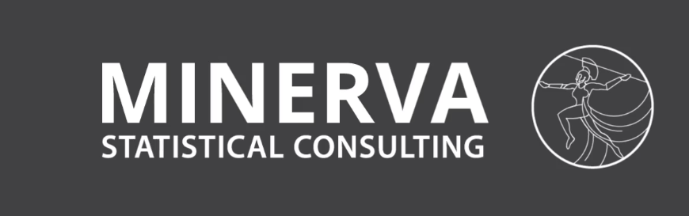

# r2day

This repository contains materials for a 2 day long course on R for beginners.

## Pre-Reqs

* This course assumes 0 prior programming knowledge.
* Please make sure to have computer with internet connection
* Both OSX and Windows will be supported

## Schedule 

1. Introductions 
  + DJB introduction
  + Peer Introduction
  + Course Goals
2. Course Objectives 
  + Objectives/Syllabus
  + Teaching caveats 
  + The Forgetting curve and learning expectations with R
3. Why R?
  + Learning Goals 
  + Lesson 
  + Reflections
4. Using R
  + Lesson Goals 
  + Lesson 
  + Reflections
5. tidyverse
  + Lesson Goals 
  + Lesson
  + Reflections
6. Modeling
  + Lesson Goals
  + ggplot2
  + Basic Statistical Modeling
  + Reflections
  

